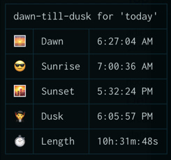

# dawn-till-dusk 🧛

A simple tool to display the sunrise, sunset and day length based on your location from the comfort of the command line.

### Example output



### Installation

```
npm i -g @mrgeorgegray/dawn-till-dusk
```

### Usage

```
Usage: dtd <command> [options]

Commands:
  index.js dtd  Display sunrise & sunset times

Options:
  --help, -h     Show help                            [boolean] [default: false]
  --version, -v  Show version number                                   [boolean]
  --clean, -c    Clear data cache                     [boolean] [default: false]
  --date, -d     Search by date                      [string] [default: "today"]
  --logging, -l  Output extra logging info            [boolean] [default: false]

Examples:
  dtd -d '2021-08-12'  display sunrise & sunset times for a given day
```

### Credits

- IP Address data from [https://ip-api.com](ip-api.com)
- Sunrise data from [https://sunrise-sunset.org/api](sunrise-sunset.org/api)
